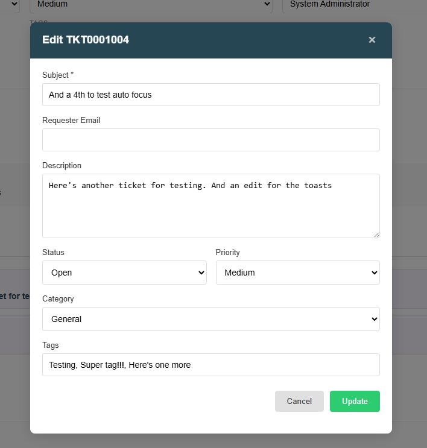
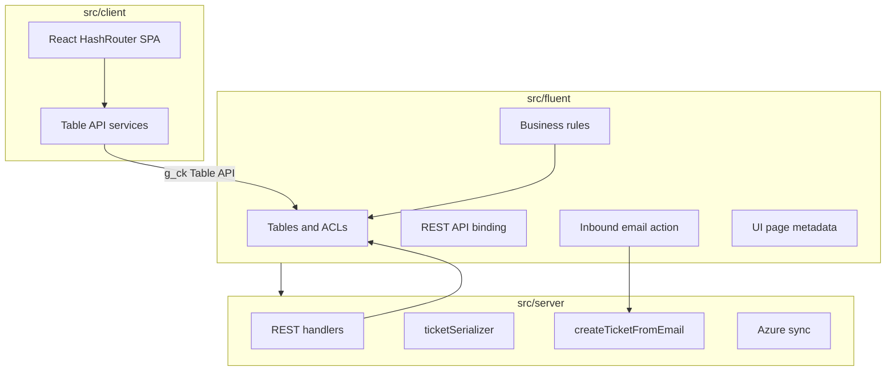

# FresherDesk

A Freshdesk-style helpdesk on ServiceNow, built with the [Now SDK](https://www.servicenow.com/docs/bundle/zurich-application-development/page/build/applications/now-sdk/concept/now-sdk-landing.html) Fluent framework. Agents work tickets in a React workspace; integrations use a REST API, inbound email, and optional Azure Blob attachment URLs.

## Contents

- [Overview](#overview)
- [Agent workspace](#agent-workspace)
- [Architecture](#architecture)
- [Data model](#data-model)
- [Prerequisites](#prerequisites)
- [Local development](#local-development)
- [Development process (Now SDK)](#development-process-now-sdk)
- [Client conventions](#client-conventions)
- [Integrations](#integrations)
- [CI/CD](#cicd)
- [Roles](#roles)
- [Out of scope (v1)](#out-of-scope-v1)

## Overview

FresherDesk provides:

- **Agent workspace** — hash-routed SPA: ticket index (`#/`) and ticket detail (`#/tickets/{sys_id}`)
- **Ticket creation** — sidebar form in the UI and inbound email ingestion
- **Conversation** — public replies and internal notes; **Audit Deltas** tab in the Conversation panel (admin) for field-change log
- **Child tickets** — nested tickets under a parent with paginated panel
- **Attachments** — `sys_attachment` in the UI; optional Azure Blob sync + SAS URLs on REST ([docs/AZURE.md](docs/AZURE.md))
- **REST API** — API-key list, get, PATCH, child create ([API.md](API.md))


> **Dev instance example:** Screenshots and curl samples below use `dev385836.service-now.com`. Replace `<instance>` with your ServiceNow host when deploying elsewhere.

## Agent workspace

Open the workspace after deploy:

```
https://<instance>/x_2058901_fresher_ticket_workspace.do
```

Requires role `x_2058901_fresher.agent`. The **Audit Deltas** tab requires `x_2058901_fresher.admin`.

### Routes

| Hash route | Page |
|------------|------|
| `#/` | Ticket index (default view: **All Tickets**; sidebar views, tag filter, pagination) |
| `#/?view={view}` | Filtered index — `all`, `mine`, `open`, `pending`, `resolved`, `closed`, or `unassigned` (`all` is the default when `view` is omitted) |
| `#/?tag=billing` | Tag filter (debounced; click a tag chip on a row to apply the same filter) |
| `#/?page=2` | Index page 2 |
| `#/?create=1` | Open create-ticket modal |
| `#/tickets/{sys_id}` | Ticket detail (use `sys_id`, not display number) |

### Ticket index

Sidebar views (**All Tickets**, **My Tickets**, **Open**, **Pending**, **Resolved**, **Closed**, **Unassigned**), tag filter, and paginated list (20 top-level tickets per page; child tickets appear only on the parent detail page). See the overview screenshot above.

### Ticket detail

Inline edits for status, priority, assignee (including **Assign to me**), and tags. Header actions: copy link, edit, delete. Category and requester are read-only on the detail page (editable via the edit modal).


**Child tickets** — paginated panel (5 per page); **Create Child** in the panel header. Child ticket detail shows a link back to the parent when applicable.


**Conversation** — tabbed panel: **Conversation** (default) and **Audit Deltas** (admin only). Thread is paginated (10 per page, opens on newest page) with public reply / internal note composer and optimistic send. Audit tab: paginated field-change log (10 per page, newest first).


### Modals

Create from sidebar **New Ticket**:


Edit from detail header:



Screenshot capture guide: [docs/images/README.md](docs/images/README.md).

## Architecture



| Layer | Path | Responsibility |
|-------|------|----------------|
| Fluent metadata | [`src/fluent/`](src/fluent/) | Tables, roles, ACLs, REST script includes, business rules, inbound email, UI page |
| Server modules | [`src/server/`](src/server/) | REST handlers (`rest/`), serializers, email ingestion, Azure upload/SAS, delta audit |
| Client SPA | [`src/client/`](src/client/) | React workspace: pages, components, Table API services |

Key server entry points:

| Concern | File |
|---------|------|
| List tickets (REST) | [`src/server/rest/listTickets.ts`](src/server/rest/listTickets.ts) |
| Get ticket | [`src/server/rest/getTicket.ts`](src/server/rest/getTicket.ts) |
| PATCH ticket | [`src/server/rest/updateTicket.ts`](src/server/rest/updateTicket.ts) |
| Create child | [`src/server/rest/createChildTicket.ts`](src/server/rest/createChildTicket.ts) |
| Email → ticket | [`src/server/email/createTicketFromEmail.ts`](src/server/email/createTicketFromEmail.ts) |
| Attachment → Azure | [`src/server/attachments/syncTicketAttachmentToAzure.ts`](src/server/attachments/syncTicketAttachmentToAzure.ts) |
| Field delta audit | [`src/fluent/business-rules/ticket-delta-audit.now.ts`](src/fluent/business-rules/ticket-delta-audit.now.ts) |

## Data model

| Table | Purpose |
|-------|---------|
| `x_2058901_fresher_ticket` | Tickets (parent/child via `parent`, tags JSON, `source`) |
| `x_2058901_fresher_ticket_comment` | Conversation + audit rows |
| `x_2058901_fresher_ticket_attachment` | Azure blob metadata (REST SAS URLs) |
| `x_2058901_fresher_api_key` | Hashed API keys for REST auth |

**Comment types** (`comment_type` on ticket comment):

| Value | UI / API |
|-------|----------|
| `public_reply` | Shown in conversation thread |
| `internal_note` | Shown in thread with internal styling |
| `audit_delta` | JSON field change; **Audit Deltas** tab only (hidden from conversation and public API) |

Fluent table definitions: [`src/fluent/tables/`](src/fluent/tables/).

## Prerequisites

- Node.js 20+
- ServiceNow instance with scoped app `x_2058901_fresher` installed
- User with `x_2058901_fresher.agent` (admins: `x_2058901_fresher.admin`)

## Local development

```bash
npm ci
npm run lint      # optional before commit
npm run build
npm run deploy    # now-sdk install — uses SN_SDK_* env or interactive auth
```

Open the workspace:

```
https://<instance>/x_2058901_fresher_ticket_workspace.do
```

**Example (dev):**

```
https://dev385836.service-now.com/x_2058901_fresher_ticket_workspace.do
```

| Script | Purpose |
|--------|---------|
| `npm run build` | Typecheck + bundle client + Fluent artifacts |
| `npm run deploy` | Install/update app on configured instance |
| `npm run lint` | ESLint on `src/` |
| `npm run dev` | Now SDK dev runner |

Scope and app name: [`now.config.json`](now.config.json) (`x_2058901_fresher`).

## Development process (Now SDK)

Full walkthrough for this repo — developer instance, clone/setup, build/deploy loop, and GitHub Actions for teams:

**[docs/DEVELOPMENT.md](docs/DEVELOPMENT.md)**

## Client conventions

Routing lives in [`src/client/app.tsx`](src/client/app.tsx):

- [`TicketIndexPage`](src/client/pages/TicketIndexPage.tsx) — list, URL query params (`view`, `tag`, `page`)
- [`TicketShowPage`](src/client/pages/TicketShowPage.tsx) — detail, paginated comments, optimistic replies

**Table API services** (use `window.g_ck`):

- [`TicketService`](src/client/services/TicketService.ts) — tickets, children, index pagination
- [`CommentService`](src/client/services/CommentService.ts) — comments and audit deltas
- [`AttachmentService`](src/client/services/AttachmentService.ts) — `sys_attachment` upload/list

**Pagination** — shared sizes in [`src/client/constants/pagination.ts`](src/client/constants/pagination.ts); UI in [`PanelPagination`](src/client/components/PanelPagination.tsx). Index page size: [`src/client/constants/tickets.ts`](src/client/constants/tickets.ts).

**Layout** — [`WorkspaceLayout`](src/client/layout/WorkspaceLayout.tsx), collapsible sidebar ([`TicketSidebar`](src/client/components/TicketSidebar.tsx)), toasts via [`WorkspaceContext`](src/client/context/WorkspaceContext.tsx).

To change list filters, edit [`TicketService.buildQuery`](src/client/services/TicketService.ts) and sidebar views in [`src/client/constants/ticketViews.ts`](src/client/constants/ticketViews.ts).

## Integrations

### REST API

Machine-to-machine access for external systems. Agents use the workspace UI above; the API does not replace the SPA for day-to-day ticket handling.

Full reference: **[API.md](API.md)** — endpoints, schemas, errors, Windows `curl` examples.

#### API key provisioning

Requires role `x_2058901_fresher.admin`:

1. Generate a secret (e.g. `fd_live_abc123...`).
2. Hash in **Scripts - Background**:

```javascript
var digest = new GlideDigest();
gs.info(digest.getSHA256Hex('YOUR_SECRET_HERE'));
```

3. Create **FresherDesk API Key** record: `name`, `key_hash`, `active=true`.
4. Store plaintext secret securely — it cannot be recovered from the hash.

Quick start (see [API.md](API.md) for full examples):

```cmd
curl.exe --ssl-no-revoke -s -H "X-API-Key: YOUR_KEY" "https://<instance>/api/x_2058901_fresher/v1/tickets/tickets?status=open&limit=50"
```

### Email ingestion

Inbound email creates top-level tickets with `source=email` and an initial public reply comment.

Guide: **[docs/EMAIL.md](docs/EMAIL.md)** — mailbox binding, test checklist, troubleshooting.

### Azure Blob attachments

Agent UI and email write to `sys_attachment` first; a business rule syncs to Azure for REST `download_url` (SAS).

Guide: **[docs/AZURE.md](docs/AZURE.md)** — instance properties, test checklist.

## CI/CD

Pull requests to `master` run lint, build, audit, and CodeQL; merges to `master` deploy to the configured instance. See **[docs/DEVELOPMENT.md — GitHub Actions and team workflow](docs/DEVELOPMENT.md#10-github-actions-and-team-workflow)** for setup, branch flow, and team practices.

## Roles

| Role | Access |
|------|--------|
| `x_2058901_fresher.agent` | CRUD tickets and comments; agent workspace |
| `x_2058901_fresher.admin` | API key management, Audit Deltas tab (includes agent) |

## Out of scope (v1)

- Customer portal
- REST attachment upload (use agent UI or email; files land on `sys_attachment` first)
- REST top-level ticket create or comment create
- Email reply threading (inbound reply creates a new ticket)
