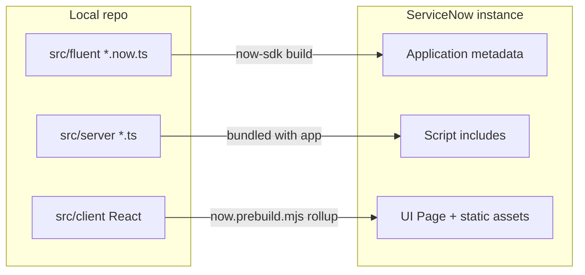
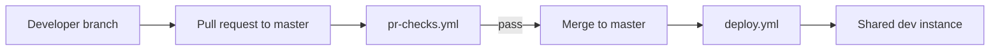

# ServiceNow development process

End-to-end guide for working on **FresherDesk**: developer instance → clone and setup → build/deploy → team CI/CD.

## Contents

- [1. Developer instance](#1-developer-instance)
- [2. Toolchain](#2-toolchain)
- [3. Project setup](#3-project-setup)
- [4. How this repo is organized](#4-how-this-repo-is-organized)
- [5. Authenticating the SDK](#5-authenticating-the-sdk)
- [6. Build and deploy loop](#6-build-and-deploy-loop)
- [7. What `npm run build` does](#7-what-npm-run-build-does)
- [8. Local UI development](#8-local-ui-development)
- [9. Verifying on the instance](#9-verifying-on-the-instance)
- [10. GitHub Actions and team workflow](#10-github-actions-and-team-workflow)
- [11. Common issues](#11-common-issues)
- [Related docs](#related-docs)

---

## 1. Developer instance

You need a ServiceNow **Personal Developer Instance (PDI)** or team-owned subproduction instance.

1. Sign in at [developer.servicenow.com](https://developer.servicenow.com/) and request a **Personal Developer Instance** (or use your org’s dev/test instance).
2. Note the instance URL, e.g. `https://dev12345.service-now.com`.
3. Log in as a user with **`admin`** (or equivalent) to deploy the app and configure integrations (email, Azure properties, API keys).
4. After deploy, assign app roles to test users (FresherDesk: `x_2058901_fresher.agent`, `x_2058901_fresher.admin` — see [README — Roles](../README.md#roles)).

PDIs sleep after inactivity; wake the instance before deploy or testing.

---

## 2. Toolchain

| Tool | Version | Purpose |
|------|---------|---------|
| [Node.js](https://nodejs.org/) | 20+ (SDK recommends 20.18+) | Build, lint, Now SDK CLI |
| npm | 8+ | Dependencies and scripts |
| Git | any recent | Source control |

Official SDK docs: [Using the ServiceNow SDK](https://www.servicenow.com/docs/csh?topicname=servicenow-sdk-landing&version=latest).

---

## 3. Project setup

Clone the repo and install dependencies:

```bash
git clone <repo-url>
cd FresherDesk
npm ci
```

`npm ci` installs `@servicenow/sdk`, React, ESLint, and other dependencies from `package-lock.json`.

### `now.config.json`

Binds this repository to the FresherDesk scoped application on your instance:

```json
{
  "scope": "x_2058901_fresher",
  "scopeId": "43e12f9235534396aae4fa734e2a9a3f",
  "name": "fresher-desk",
  "tsconfigPath": "./src/server/tsconfig.json"
}
```

| Field | Meaning |
|-------|---------|
| `scope` | Application scope prefix (tables, roles, UI pages) |
| `scopeId` | Scoped app `sys_id` on the instance where the app was first installed |
| `name` | Package name for the SDK |
| `tsconfigPath` | TypeScript project for server-side modules |

If you deploy to an instance that did not have FresherDesk installed before, the SDK may update `scopeId` under `src/fluent/generated/`. Commit those changes with your team so everyone targets the same application record.

---

## 4. How this repo is organized



| Directory | Contents | Deployed as |
|-----------|----------|-------------|
| [`src/fluent/`](../src/fluent/) | Fluent metadata: tables, ACLs, roles, business rules, REST API definition, inbound email, UI page shell | Application records in scope `x_2058901_fresher` |
| [`src/server/`](../src/server/) | Server-side TypeScript: REST handlers, serializers, email script, Azure sync | Script modules referenced by Fluent |
| [`src/client/`](../src/client/) | React SPA (HashRouter), services, CSS | Static bundle attached to UI page `x_2058901_fresher_ticket_workspace.do` |

**Authoring flow:** define structure in Fluent (`.now.ts`) → implement logic in `src/server/` → build UI in `src/client/` → `npm run build` → `npm run deploy`.

---

## 5. Authenticating the SDK

`npm run deploy` runs `now-sdk install`, which pushes the built app to your instance. The CLI needs credentials.

### Local (developer machine)

Set environment variables (PowerShell example):

```powershell
$env:SN_SDK_INSTANCE_URL = "https://dev12345.service-now.com"
$env:SN_SDK_USER = "admin"
$env:SN_SDK_USER_PWD = "your-password"
```

Then:

```bash
npm run deploy
```

Alternatively, run deploy without env vars and follow the SDK’s interactive login prompt.

### OAuth (optional)

For CI or orgs that disallow password auth, configure OAuth variables documented in [`.github/workflows/deploy.yml`](../.github/workflows/deploy.yml) (`SN_SDK_AUTH_TYPE`, `SN_SDK_OAUTH_CLIENT_ID`, `SN_SDK_OAUTH_CLIENT_SECRET`).

---

## 6. Build and deploy loop

Typical day-to-day cycle:

```bash
# 1. Edit Fluent, server, or client source
# 2. Lint (optional but recommended)
npm run lint

# 3. Compile and bundle
npm run build

# 4. Push to instance
npm run deploy

# 5. Smoke-test in browser
#    https://<instance>/x_2058901_fresher_ticket_workspace.do
```

| npm script | Command | When to use |
|------------|---------|-------------|
| `lint` | `eslint src` | Before commit / PR |
| `build` | `now-sdk build` | After code changes; required before deploy |
| `deploy` | `now-sdk install` | Publish build to instance |
| `dev` | `now-sdk run dev` | Client watch + faster UI iteration (see below) |

**Rule of thumb:** never deploy without a successful `npm run build`. CI enforces this on pull requests.

---

## 7. What `npm run build` does

1. **Typecheck** — Server and Fluent TypeScript (`src/server/tsconfig.json`).
2. **Prebuild** — [`now.prebuild.mjs`](../now.prebuild.mjs) runs Rollup on `src/client/**/*.html`, bundles React into static assets under the SDK output directory, with ServiceNow-aware plugins (`@servicenow/isomorphic-rollup`).
3. **Fluent compile** — `.now.ts` files become application metadata (tables, rules, REST bindings, UI page registration).
4. **Artifact** — Packaged scoped application ready for `now-sdk install`.

A failed build usually means a TypeScript error in `src/server/` or `src/client/`, or invalid Fluent metadata in `src/fluent/`.

---

## 8. Local UI development

`npm run dev` uses [`now.dev.mjs`](../now.dev.mjs) to **watch** client files and rebuild the static bundle on change. Pair it with SDK dev mode so you can refresh the UI page on the instance without a full deploy for every CSS tweak.

Server-side and Fluent changes still require `npm run build` and `npm run deploy`.

Client code talks to the instance via the **Table API** (`/api/now/table/...`) using `window.g_ck` — the UI only works when loaded **on** the ServiceNow instance (not as a standalone `file://` or unrelated host).

---

## 9. Verifying on the instance

After deploy:

1. **Application** — **System Applications → Studio** or **My Company Applications** → confirm **FresherDesk** (`x_2058901_fresher`) is installed and not in a broken state.
2. **Workspace** — Open `https://<instance>/x_2058901_fresher_ticket_workspace.do` as a user with the agent role.
3. **REST** — Smoke-test with [API.md](../API.md) if you changed handlers.
4. **Email / Azure** — Follow [EMAIL.md](EMAIL.md) and [AZURE.md](AZURE.md) when those integrations change.

UI reference screenshots: [README — Agent workspace](../README.md#agent-workspace).

---

## 10. GitHub Actions and team workflow

This repo uses two workflows:



### Pull requests — [`.github/workflows/pr-checks.yml`](../.github/workflows/pr-checks.yml)

Runs on every PR targeting **`master`**:

| Job | What it does |
|-----|----------------|
| **Lint & build** | `npm ci` → `npm run lint` → `npm run build` |
| **Dependency audit** | `npm audit` on production deps (high severity+) |
| **CodeQL** | Static security analysis on JS/TS after build |

**Team practice:** open a PR for all non-trivial changes; wait for green checks before merge. Fixes TypeScript and lint issues locally first to avoid slow CI cycles.

### Deploy — [`.github/workflows/deploy.yml`](../.github/workflows/deploy.yml)

Runs on **push to `master`**:

1. `npm ci`
2. `npm run build`
3. `npm run deploy` with `SN_SDK_NODE_ENV=SN_SDK_CI_INSTALL`

Configure **GitHub → Settings → Secrets and variables → Actions**:

| Type | Name | Purpose |
|------|------|---------|
| Variable | `SN_SDK_INSTANCE_URL` | Target instance, e.g. `https://dev385836.service-now.com` |
| Variable | `SN_SDK_USER` | Deploy user (often a dedicated integration account, not personal admin) |
| Secret | `SN_SDK_USER_PWD` | Password for deploy user |

**Team patterns:**

- **Shared dev instance** — `master` deploys to one integration instance the whole team tests against; feature branches deploy only locally unless you add a separate workflow/environment.
- **Protected `master`** — Require PR + passing checks before merge so broken builds never reach deploy.
- **Concurrency** — Deploy workflow uses `cancel-in-progress: true` so rapid merges do not stack conflicting installs.
- **Credentials** — Use a service account with rights to install/update the scoped app; rotate password via GitHub secret update. Do not commit instance passwords to the repo.
- **Production** — This workflow targets a single instance from repo variables. For prod, add a separate branch/environment (e.g. `release` + manual approval + different `SN_SDK_INSTANCE_URL`) rather than pointing `master` at production.

### Suggested branch flow

1. `git checkout -b feature/my-change`
2. Develop locally: `lint` → `build` → `deploy` to your PDI or shared dev.
3. Push branch, open PR to `master`.
4. Review + merge after CI passes → automatic deploy to the instance configured in GitHub Actions.
5. Team validates on shared dev; tag or promote separately for higher environments.

---

## 11. Common issues

| Symptom | Things to check |
|---------|-----------------|
| Deploy auth failure | `SN_SDK_*` env vars; user locked out; instance asleep (PDI) |
| Build TypeScript errors | `src/server/` imports; run `npm run build` locally and read first error |
| UI blank after deploy | Browser console; confirm UI page endpoint matches `src/fluent/ui-pages/` |
| Table API 401/403 | User missing app role; ACLs in `src/fluent/acls/` |
| CI build passes locally fails | Node version (use 20); run `npm ci` not `npm install` |
| `scopeId` / install conflicts | App already exists under different scope on instance; align `now.config.json` with generated keys |

---

## Related docs

- [README.md](../README.md) — product overview, UI tour, architecture, local commands
- [API.md](../API.md) — REST API for integrations
- [EMAIL.md](EMAIL.md) — inbound email setup
- [AZURE.md](AZURE.md) — attachment sync to Azure Blob
- [ServiceNow SDK documentation](https://www.servicenow.com/docs/csh?topicname=servicenow-sdk-landing&version=latest)
- [Fluent language overview](https://www.servicenow.com/docs/csh?version=latest&topicname=servicenow-fluent.html)
