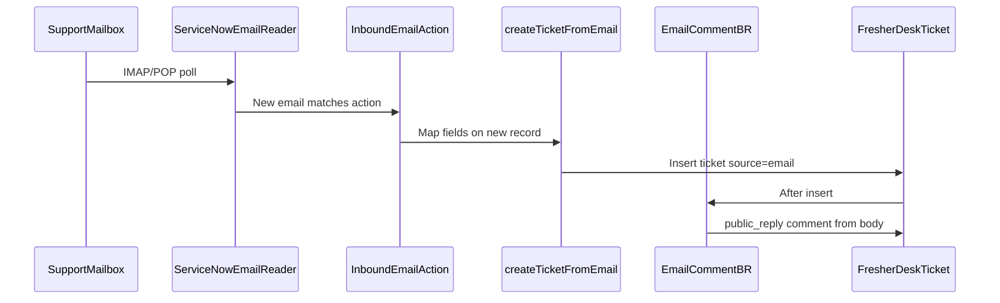

# Email ingestion (FresherDesk)

Inbound email creates **top-level** FresherDesk tickets on `dev385836.service-now.com` (or your instance). Reply threading is **not** supported in v1 — each new inbound message creates a new ticket unless you add that later.

## How it works



| Component | Record / file |
|-----------|----------------|
| Inbound action | **FresherDesk Create Ticket from Email** (`sysevent_in_email_action`, scoped app) — [`create-ticket-from-email.now.ts`](../src/fluent/inbound-email/create-ticket-from-email.now.ts) |
| Script | [`createTicketFromEmail.ts`](../src/server/email/createTicketFromEmail.ts) — subject, body, requester, attachments |
| Business rule | **FresherDesk Email Comment on Insert** — [`ticket-email-comment.now.ts`](../src/fluent/business-rules/ticket-email-comment.now.ts) |

After deploy, confirm both are **Active** in the **FresherDesk** application scope (`x_2058901_fresher`).

---

## Prerequisites

1. **Deploy** the app (`npm run build` then `npm run deploy` or CI to `master`).
2. A **real support mailbox** with **IMAP** (preferred) or **POP3** credentials.
3. Instance allows inbound email (admin): verify system properties such as `glide.email.read.active` if mail never arrives.
4. Scheduled job **Process Inbound Email** (or **Email Inbound**) is **Active** (runs every few minutes).

---

## Instance setup (dev385836)

### 1. Create inbound email account

As **admin** (global):

1. Go to **System Mailboxes → Email → Email Accounts** (or **Administration → Email Accounts**).
2. **New**:
   - **Type:** Inbound — IMAP (or POP3)
   - **Name:** `FresherDesk Support`
   - **Email address:** your support alias (e.g. `support@yourdomain.com`)
   - **Mail server / port / SSL:** per provider (typical IMAP: port **993**, SSL on)
   - **User name** and **Password:** mailbox credentials
   - **Active:** checked
3. Use **Test connection**, then **Save**.

### 2. Bind mailbox to the FresherDesk inbound action

1. Switch to the **FresherDesk** scope (`x_2058901_fresher`).
2. Open **Inbound Email Actions** → **FresherDesk Create Ticket from Email**.
3. Set **Mailbox** to the account from step 1 (so unrelated instance mail does not create FresherDesk tickets).
4. Confirm:
   - **Table:** FresherDesk Ticket (`x_2058901_fresher_ticket`)
   - **Type:** New
   - **Action:** Record action
   - **Order:** 100
   - **Stop processing:** checked
   - **Active:** checked

### 3. Verify processing

1. Send a test email to the support address (plain text is enough for a first test).
2. Wait for the inbound job (or run **Process Inbound Email** manually if you have permission).
3. Check **System Mailboxes → Email → Inbound Email** (or **Received Emails**) for errors.
4. Open the [agent workspace](https://dev385836.service-now.com/x_2058901_fresher_ticket_workspace.do) — new ticket with **Source = Email**.

---

## Test checklist

| # | Action | Expected |
|---|--------|----------|
| 1 | Send email with subject + body | New `TKT…`, `source=email`, subject/body on ticket |
| 2 | Open ticket in workspace | **public_reply** comment matches email body |
| 3 | Send from address **not** in `sys_user` | `requester_email` = sender; comment author empty (not Guest) |
| 4 | Send email with PDF/image attached | Attachment on ticket (UI + REST GET `attachments[]`) |
| 5 | REST GET ticket | `source: "email"`, tags/comments/attachments as documented in [API.md](API.md) |

### REST smoke test (after email creates a ticket)

Replace `TKT0001234` with the ticket number from the email:

```cmd
curl.exe --ssl-no-revoke -s -H "X-API-Key: fd_live_dev_test_abc123xyz" "https://dev385836.service-now.com/api/x_2058901_fresher/v1/tickets/tickets/TKT0001234"
```

Check `result.ticket.source`, `result.ticket.requester.email`, `result.ticket.comments`, and `result.ticket.attachments`.

---

## Troubleshooting

| Symptom | What to check |
|---------|----------------|
| No ticket created | Inbound action **Active**? **Mailbox** set? Email in **Received Emails** with error? |
| Ticket but no comment | Business rule **FresherDesk Email Comment on Insert** active? Body empty? |
| Wrong author (Guest) | Deploy latest code (external senders should leave `opened_by` empty). |
| No attachments | Email actually had attachments? Inbound script logs; `saveAttachments` runs on insert. |
| Duplicate tickets | Multiple inbound actions matching same mail — tighten **Mailbox** or **Order** / **Stop processing**. |
| Reply creates **new** ticket | Expected in v1 (no reply threading). |

---

## Out of scope (v1)

- Updating an existing ticket when customer replies (`Re:` / ticket number in subject)
- Auto-reply to sender (`reply_email` action type)
- REST endpoint to create tickets (use email or agent UI)

Implementation: [`src/server/email/`](../src/server/email/), [`src/fluent/inbound-email/`](../src/fluent/inbound-email/).
